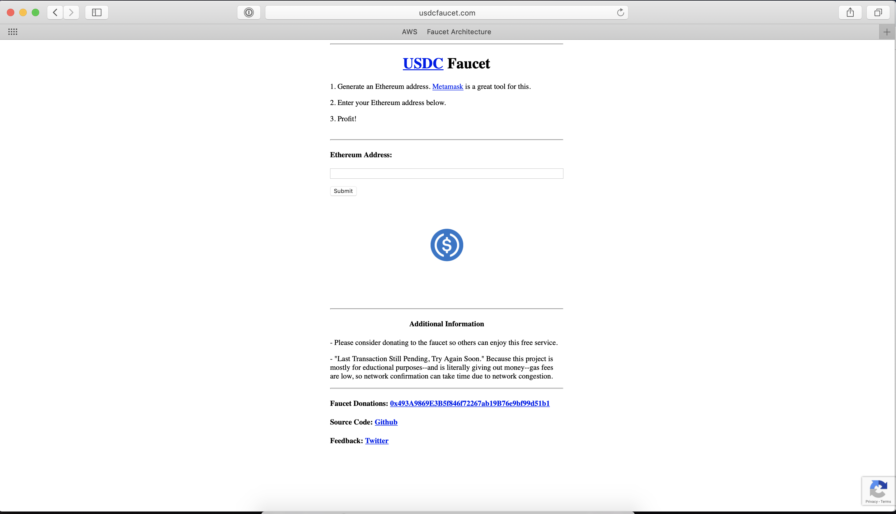

##### This is the source code powering [usdcfaucet.com](http://www.usdcfaucet.com), a free crypto faucet.

## Prerequisites

- Send some USDC ERC-20 tokens to an eth address that you own the private key to. Make sure the address also has ETH as gas.
- https://infura.io account. Free version works!
- Google recaptcha v2 account
- Nodejs 8.10

## Setup

To start, clone the repo and install modules

1. `ccmonkey user$ npm install`

## AWS

- Lambda + API Gateway setup + S3 + DynamoDB
Good tutorial here https://aws.amazon.com/getting-started/projects/build-serverless-web-app-lambda-apigateway-s3-dynamodb-cognito/

- Lambda setup with one function RequestUSDC, Node.js 8.10
    * Be sure to fill the environment variables.
ethAddress, ethPrivateKey, infuraProjectSecret

- DynamoDB setup with three tables:
* (TableName, Column, Column, etc.)
    * Currency: CurrencyName, Nonce
    * Request: UserId, NumberOfRequests
    * Send: SendId, DestinationAddress, ETHSendURL, IPAddress, SendDate, TxHash, Testnet

- Lambda Layers
We only deploy the api code each time we push to Lambda. This allows our deploys to be much faster as we don't need to re-deploy sizable node modules unless our dependencies change.

### Web

Navigate to the Web directory

1. `ccmonkey user$ npm install http-server -g`
2. `web user$ http-server`
3. in chrome, go to http://localhost:8080/
